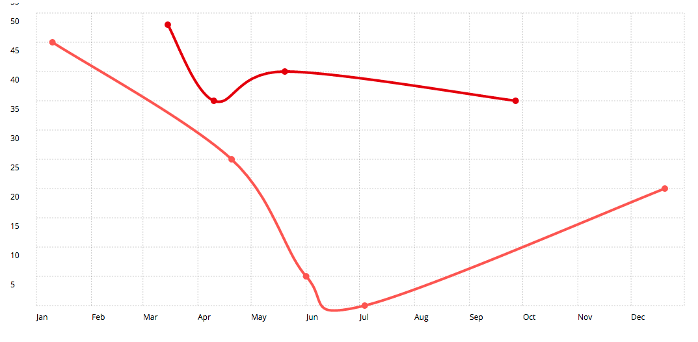

# Months axix plugin for Chartist.js

This plugin allows the creation of fixes mothns steps of a year in axis. 

In order to use it, you will need to include the excellent charting library Chartist.js in your page.

http://gionkunz.github.io/chartist-js/index.html


## Available options and their defaults

```javascript
var defaultOptions = {
  // The current year to use as base of the months in the axis.
  year: 'YYYY',
};
```

## Sample usage

```javascript
var chart = new Chartist.Line('.ct-chart', {
  series: [
    {
      name: 'series-1',
      data: [
        {x: new Date(2016, 2, 15), y: 53},
        {x: new Date(2016, 3, 10), y: 40},
        {x: new Date(2016, 4, 20), y: 45},
        {x: new Date(2016, 8, 27), y: 40}
      ]
    },
    {
      name: 'series-2',
      data: [
        {x: new Date(2016, 0, 10), y: 50},
        {x: new Date(2016, 3, 20), y: 30},
        {x: new Date(2016, 5, 1), y: 10},
        {x: new Date(2016, 6, 4), y: 5},
        {x: new Date(2016, 11, 20), y: 25}
      ]
    }
  ]
}, {
  height: '500px',
  axisX: {
    type: Chartist.MonthsAxis,
    year: 2016,
    labelInterpolationFnc: function(value) {
      return moment(value).format('MMM');
    }
  }
});
```

### Example
Click on the image to see the pen in action:
<p align="center">
  <a href="http://codepen.io/benmoussa/pen/qqJgPB/"></a>
</p>
